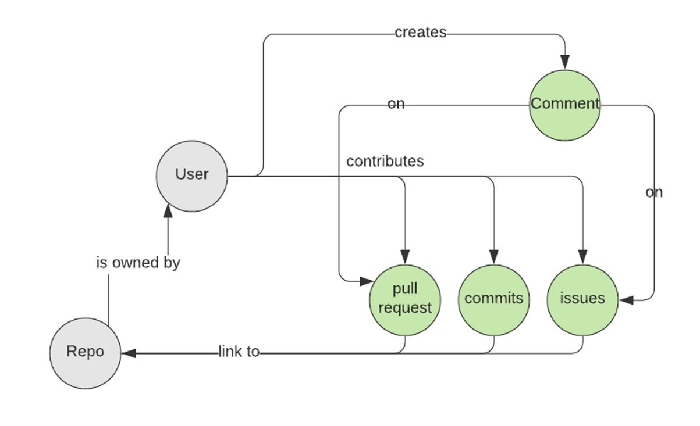

# Git scraper 


[](https://github.com/nikolanikushev/git-scraper/blob/main/LICENSE)
[]()
[]()

[![Open Issues][issues-image]][issues-url]

Git scraper is a tool developer by [Nikola Nikushev](https://github.com/nikolanikushev) for a university project at [Vienna University of Economics and Business](https://www.wu.ac.at/en/dpkm).
The tool collects github repository information using the github rest api client.
 
## Contents

* [Setup](#setup)
* [What content does the scraper collect](#what-content-does-the-scraper-collect)
* [How to use](#how-to-use)
* [Project architecture](#project-architecture)
* [Contributing](#contributing)

## What content does the scraper collect?
The git scraper collects information found relative to create a user activity analysis.
It links a `REPO` with all the `contributors` for the `REPO` to collect the information relevant for the contributors.
The information found relevant for one project can be seen in the graph below: 

- A user creates a repository. 
- Multiple users can contribute to a project using one or more of the methods:
  - Add commits
  - Add comments on Pull requests or Issues
  - Creating issues or pull requests
  - Close issues or pull requests

The relevant information, for analysis, is stored in a CSV folder.
For contextual data we also store multiple results in JSON format to understand what data produced the CSVs

## Setup
1. To use this project you need to have [NodeJS](https://nodejs.org/en/) 10+.
1. Obtain a person github token from the [settings page](https://github.com/settings/tokens)
1. Copy `.env.sample` file  to `.env` with the following contents, by replacing `<your token>` with your token:
    ```
    GITHUB_TOKEN=<your token>
    OUTPUT_FOLDER=<your output folder>
    SINGLE_CSV_FILE=<true/false>
    RETRY_ON_RATE_LIMIT_REACHED=<true/false>
    ```
1.  run `yarn` or `npm install`

## How to use
- Assuming you have the project configured, you can provide the following variables in the `.env` file:
    - OUTPUT_FOLDER - this allows you to configure where would you like the outputs of the project to be
    - SINGLE_CSV_FILE - should all outputs go into 1 single file, instead of grouping by project
    - RETRY_ON_RATE_LIMIT_REACHED - If you are requesting data for projects with more than 3000 issues you will get an error that you have reached
    your RATE_LIMIT. If you set to `true` the process will continue from where it last left off when rate limit error is thrown.
     Default users have a rate of 5000 per 30 minute, but you can check here [rate limit by github](https://docs.github.com/en/free-pro-team@latest/rest/reference/rate-limit). 

- Then you can provide a list of projects inside the [input.json](./src/input.json).

All the projects inside the `input.json` will be loaded and sent as output to the `OUTPUT_FOLDER`

### Make the CSV unique
If for some reason you believe your data might have duplicates, you can run:
`yarn neek --input <your_output_folder>/csv/<fileName>.csv --output pathToOther/unique.csv`

## Project architecture

The project structure is as follows:
- `src` - Folder with the main core code
    - `example` - Folder which shows examples for a single repo    
    - `api.ts` - Main class wrapper around the octokit rest api endpoints that we use    
    - `CustomOctokit.ts` - Creates a wrapper on the octokit client to configure rate limiting    
    - `index.ts` - Main workflow file that loads all the projects inside the `input.json`    
    - `input.json` - Holds all the projects that will be loaded when we run `yarn start`    
    - `loadEnv.ts` - Uses the `dotenv` package to load the environment variables    
    - `ProjectLoader.ts` - Creates a class that executes the API calls and wraps the responses from the rest API and writes the outputs to JSON and CSV files    
    - `toCSV.ts` - Holds functions that transform a JSON into a CSV file entry    
    - `writeToFile.ts` - Holds functions that write contents to a file. All folders get created recursively and we do not overwrite/delete old files     

## Contributing

Make a pull request or post an issue and tag [NikolaNikushev](https://github.com/nikolanikushev)

### Commits
All commits follow the rules for [Semantic Commits](https://www.conventionalcommits.org/en/v1.0.0/)

More details can be seen for allowed commits in [./commitlint.config.js](./commitlint.config.js)

### Release
The project uses automatic release notes generated using git actions in the [semantic-release workflow](./.github/workflows/semantic-release.yml)
Once a change has been pushed to master, the workflow processes the current commits by running the `semantic-release` command.
 
[project-url]: https://github.com/nikolanikushev/git-scraper
[package-url]: https://badge.fury.io/js/git-scraper
[issues-image]: https://img.shields.io/github/issues/nikolanikushev/git-scraper.svg?style=popout
[issues-url]: https://github.com/nikolanikushev/git-scraper/issues
